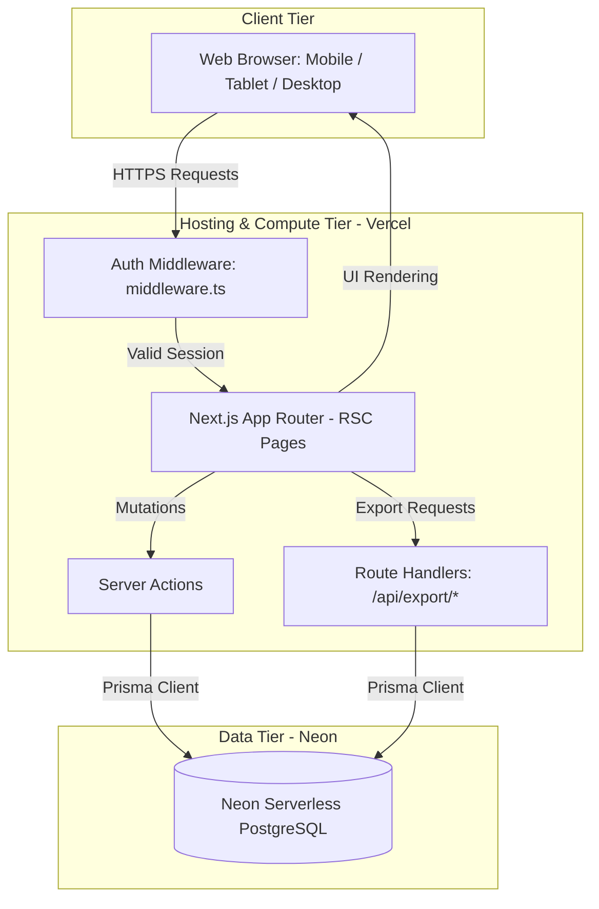
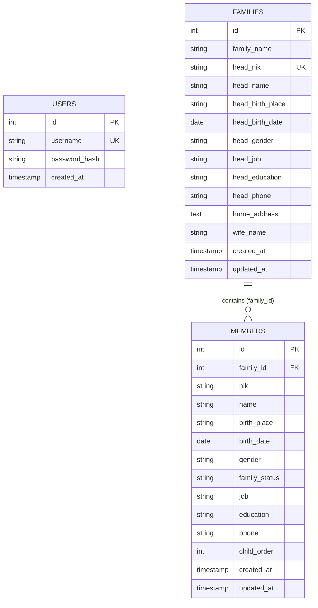

# Product Requirement Document (PRD): IKKFMS Web Portal
**Version:** 2.0 (Final)
**Date:** June 2026
**Status:** Approved — Ready for Development
**Project:** Migrating IKKFMS-APP from Electron Desktop → Next.js Web App on Vercel

---

## Table of Contents
1. [Project Background & Context](#1-project-background--context)
2. [Product Vision & Migration Goals](#2-product-vision--migration-goals)
3. [Target Audience & Personas](#3-target-audience--personas)
4. [Technical Architecture & Stack](#4-technical-architecture--stack)
5. [Authentication & Security](#5-authentication--security)
6. [Database Schema](#6-database-schema)
7. [Feature Specifications](#7-feature-specifications)
8. [UI/UX Design Guidelines](#8-uiux-design-guidelines)
9. [Non-Functional Requirements](#9-non-functional-requirements)
10. [Project File Structure](#10-project-file-structure)
11. [Deployment & Environment Configuration](#11-deployment--environment-configuration)
12. [Implementation Roadmap](#12-implementation-roadmap)

---

## 1. Project Background & Context

### 1.1. What is IKKFMS?
**IKKFMS** stands for **Ikatan Kerukunan Keluarga Feto Mone Sorong** (Sorong Feto Mone Family Harmony Association). It is an officially registered community organization in Sorong, Southwest Papua, Indonesia, established to preserve familial, social, and cultural bonds among its members.

- **Official Registration**: Decreed by the Indonesian Ministry of Law and Human Rights (Kementerian Hukum dan Hak Asasi Manusia Republik Indonesia), Decree Number: **AHU-0009368.AH.01.07. Tahun 2024**.
- **Feto Mone**: Refers to "sisters and brothers" or "women and men" in the Timorese/Tetum language, representing the community's ancestral heritage.

### 1.2. Origin: The Desktop Application
The original **IKKFMS-APP** was built as an **Electron desktop application** — a local Next.js server wrapped inside Electron, storing data in a local SQLite database (`better-sqlite3`). While functional, this architecture presented several limitations: data is siloed per machine, updates require manual reinstallation, and the app cannot be accessed remotely.

---

## 2. Product Vision & Migration Goals

The **IKKFMS Web Portal** replaces the desktop app with a secure, cloud-based population database and demographic reporting tool. Operating as a responsive web application, it allows the association's administrator to manage member demographics from any desktop, tablet, or mobile device with a browser.

### 2.1. What Changes

| Aspect | Desktop (Previous) | Web (New) |
| :--- | :--- | :--- |
| Runtime | Electron shell + bundled Node binary | Next.js 15 on Vercel (serverless) |
| Database | SQLite (`better-sqlite3`, local file) | Neon Serverless PostgreSQL |
| Query Layer | Raw SQL via `better-sqlite3` | **Prisma ORM** |
| Authentication | None (local machine = trusted) | Credentials-based auth via **Auth.js v5** |
| Distribution | Installer (`.exe` / `.dmg`) | URL in any web browser |
| Updates | Manual re-install | Automatic (Vercel CI/CD on git push) |
| Offline Support | Full | Not required |

### 2.2. What Is Preserved

- All business logic (CRUD for families and members)
- Dashboard statistics and demographic breakdowns
- Excel export format (family header rows + member rows)
- PDF export with official IKKFMS letterhead ("Kop Surat") and Ministry of Law decree reference
- Family-based data hierarchy (`families` → `members`)
- Member display sort order
- Dark mode UI

### 2.3. What Is Removed

- Electron main process, preload scripts, and `BrowserWindow` configuration
- Bundled Node binary (`node-bin`) and ABI management
- Dynamic port discovery logic
- `concurrently` dev script
- `electron-builder` packaging and all platform-specific build targets (`dist:win`, `dist:mac`)
- `better-sqlite3` native dependency

---

## 3. Target Audience & Personas

| Role | Description |
| :--- | :--- |
| **Administrator (Admin)** | A single authorized board member responsible for all data operations: registering families, adding/editing/removing members, viewing statistical reports, and exporting official documents for association meetings. |

> **Note:** The system is a single-user application. Only one admin account exists and it is pre-seeded. There is no public registration flow and no user management UI.

---

## 4. Technical Architecture & Stack

### 4.1. System Architecture



### 4.2. Core Tech Stack

| Layer | Technology | Notes |
| :--- | :--- | :--- |
| Framework | **Next.js 15** (App Router) | Server Components + Server Actions |
| Language | **TypeScript** | Migrated from JS for full type safety |
| Styling | **Tailwind CSS v4** | Utility-first, no change from desktop |
| Fonts | **Geist** (sans + mono) | No change from desktop |
| ORM | **Prisma ORM** | Replaces raw `better-sqlite3` SQL |
| Database | **Neon** (Serverless PostgreSQL) | Vercel Marketplace integration |
| Authentication | **Auth.js v5 (NextAuth)** | Credentials provider, JWT sessions |
| Excel Export | **ExcelJS** | Replaces `xlsx` — more capable, actively maintained |
| PDF Export | **jsPDF + jspdf-autotable** | No change from desktop |
| Package Manager | **pnpm** | Faster installs, better disk efficiency |
| Deployment | **Vercel** | Serverless, auto-deploy from GitHub |

### 4.3. Rendering Strategy

| Page | Strategy | Rationale |
| :--- | :--- | :--- |
| Dashboard (`/`) | React Server Component (RSC) | Prisma aggregation queries at request time |
| Family List (`/families`) | RSC | Paginated DB read, no client-side state needed |
| Family Detail (`/families/[id]`) | RSC | Fetches family + members in one server pass |
| Family Create/Edit Forms | Client Component + Server Action | Form interactivity + server-side mutation |
| Member Add/Edit (modal) | Client Component + Server Action | Inline within family detail page |
| Global Search (`/members/search`) | Client Component + Server Action | Debounced input, real-time results |
| Excel Export | Route Handler (`GET /api/export/excel`) | Streams file download response |
| PDF Export | Route Handler (`GET /api/export/pdf`) | Streams file download response |

---

## 5. Authentication & Security

### 5.1. Strategy
**Auth.js v5 (NextAuth)** with a **Credentials provider** (username + bcrypt-hashed password). Sessions are managed via **JWT** (stateless; no session database required — Vercel-compatible).

### 5.2. Admin Account
There is exactly **one administrator account**, pre-seeded by `prisma/seed.ts`.

| Field | Default Value |
| :--- | :--- |
| Username | `admin` |
| Password | `admin` (stored as bcrypt hash, cost factor 12) |

> ⚠️ **Important:** Change the default password immediately after first deployment to production.

### 5.3. Session & Cookie Configuration
- Sessions stored as signed **HTTP-only, Secure, SameSite=Lax cookies** to mitigate XSS and CSRF risks
- JWT secret configured via `AUTH_SECRET` environment variable
- Session expiry: **24 hours** (configurable)

### 5.4. Route Protection
All application routes are protected by `middleware.ts`. Unauthenticated users are redirected to `/login`. The `/login` route is the only publicly accessible page.

| Route Pattern | Access |
| :--- | :--- |
| `/login` | Public |
| `/` (Dashboard) | Authenticated Admin |
| `/families/*` | Authenticated Admin |
| `/members/search` | Authenticated Admin |
| `/api/export/*` | Authenticated Admin |

---

## 6. Database Schema

### 6.1. Overview
The schema is a semantic port from SQLite to PostgreSQL with these key improvements:

| Change | Reason |
| :--- | :--- |
| `INTEGER AUTOINCREMENT` → `SERIAL` | Native PostgreSQL integer sequences |
| `TEXT` date fields → `DATE` / `TIMESTAMP` types | Proper date semantics and indexing |
| Education and family status fields gain controlled vocabulary | Prevents invalid values via application-level enums |
| `updated_at` auto-maintained by Prisma `@updatedAt` | Eliminates manual trigger maintenance |
| `users` table added | Stores hashed credentials for Auth.js |

### 6.2. Entity Relationship Diagram



### 6.3. Prisma Schema (`prisma/schema.prisma`)

```prisma
generator client {
  provider = "prisma-client-js"
}

datasource db {
  provider  = "postgresql"
  url       = env("DATABASE_URL")
  directUrl = env("DIRECT_URL")
}

// ─── Enums ────────────────────────────────────────────────────────────────────

enum Gender {
  LAKI_LAKI @map("Laki-laki")
  PEREMPUAN @map("Perempuan")
}

enum Education {
  SD
  SMP
  SMA
  SMK
  D3
  S1
  S2
  S3
  LAINNYA
}

enum FamilyStatus {
  ISTRI     @map("Istri")
  ANAK      @map("Anak")
  CUCU      @map("Cucu")
  MENANTU   @map("Menantu")
  ORANG_TUA @map("Orang Tua")
  LAINNYA   @map("Lainnya")
}

// ─── Models ───────────────────────────────────────────────────────────────────

model User {
  id           Int      @id @default(autoincrement())
  username     String   @unique
  passwordHash String   @map("password_hash")
  createdAt    DateTime @default(now()) @map("created_at")

  @@map("users")
}

model Family {
  id             Int        @id @default(autoincrement())
  familyName     String     @map("family_name")
  headNik        String     @unique @map("head_nik")
  headName       String     @map("head_name")
  headBirthPlace String?    @map("head_birth_place")
  headBirthDate  DateTime?  @map("head_birth_date") @db.Date
  headGender     Gender     @default(LAKI_LAKI) @map("head_gender")
  headJob        String?    @map("head_job")
  headEducation  Education? @map("head_education")
  headPhone      String?    @map("head_phone")
  homeAddress    String?    @map("home_address")
  wifeName       String?    @map("wife_name")
  createdAt      DateTime   @default(now()) @map("created_at")
  updatedAt      DateTime   @updatedAt @map("updated_at")

  members        Member[]

  @@map("families")
}

model Member {
  id           Int          @id @default(autoincrement())
  familyId     Int          @map("family_id")
  nik          String
  name         String
  birthPlace   String?      @map("birth_place")
  birthDate    DateTime?    @map("birth_date") @db.Date
  gender       Gender?
  familyStatus FamilyStatus @default(ANAK) @map("family_status")
  job          String?
  education    Education?
  phone        String?
  childOrder   Int?         @map("child_order")
  createdAt    DateTime     @default(now()) @map("created_at")
  updatedAt    DateTime     @updatedAt @map("updated_at")

  family       Family       @relation(fields: [familyId], references: [id], onDelete: Cascade)

  @@map("members")
}
```

### 6.4. PostgreSQL DDL Reference
> For direct database inspection or manual migration scripts.

```sql
-- Enable UUID extension (optional, for future use)
-- CREATE EXTENSION IF NOT EXISTS "uuid-ossp";

CREATE TABLE users (
    id            SERIAL PRIMARY KEY,
    username      VARCHAR(50)  NOT NULL UNIQUE,
    password_hash VARCHAR(255) NOT NULL,
    created_at    TIMESTAMP    DEFAULT CURRENT_TIMESTAMP
);

CREATE TABLE families (
    id               SERIAL PRIMARY KEY,
    family_name      VARCHAR(255) NOT NULL,
    head_nik         VARCHAR(16)  NOT NULL UNIQUE,
    head_name        VARCHAR(255) NOT NULL,
    head_birth_place VARCHAR(255),
    head_birth_date  DATE,
    head_gender      VARCHAR(20)  DEFAULT 'Laki-laki',
    head_job         VARCHAR(255),
    head_education   VARCHAR(50),
    head_phone       VARCHAR(20),
    home_address     TEXT,
    wife_name        VARCHAR(255),
    created_at       TIMESTAMP    DEFAULT CURRENT_TIMESTAMP,
    updated_at       TIMESTAMP    DEFAULT CURRENT_TIMESTAMP
);

CREATE TABLE members (
    id            SERIAL PRIMARY KEY,
    family_id     INT          NOT NULL REFERENCES families(id) ON DELETE CASCADE,
    nik           VARCHAR(16)  NOT NULL,
    name          VARCHAR(255) NOT NULL,
    birth_place   VARCHAR(255),
    birth_date    DATE,
    gender        VARCHAR(20),
    family_status VARCHAR(50)  NOT NULL DEFAULT 'Anak',
    job           VARCHAR(255),
    education     VARCHAR(50),
    phone         VARCHAR(20),
    child_order   INT,
    created_at    TIMESTAMP    DEFAULT CURRENT_TIMESTAMP,
    updated_at    TIMESTAMP    DEFAULT CURRENT_TIMESTAMP
);
```

---

## 7. Feature Specifications

### 7.1. Login Page (`/login`)
- Centered card layout with IKKFMS logo
- Username and password fields
- Error state for invalid credentials ("Username atau password salah")
- Redirects to `/` (Dashboard) on success
- No "Forgot password" or "Register" links

### 7.2. Dashboard (`/`)
Implemented as a React Server Component, querying Prisma aggregations directly.

**Metric Cards:**
| Card | Value |
| :--- | :--- |
| Total Keluarga | `COUNT(families)` |
| Total Anggota | `COUNT(members)` (excludes heads of household) |
| Total Jiwa | Total Keluarga + Total Anggota |
| Rata-rata Ukuran Keluarga | Total Jiwa / Total Keluarga |

**Activity Growth (last 30 days):**
- Families added
- Members added

**Demographic Distribution Charts (horizontal progress bars):**
- Gender composition (Laki-laki vs. Perempuan) — covers both heads and members
- Education level breakdown (SD, SMP, SMA/SMK, D3, S1, S2, S3, Lainnya) — covers both
- Family relationship status (Istri, Anak, Cucu, Menantu, Orang Tua, Lainnya) — members only

### 7.3. Family Registry

#### 7.3.1. Family List (`/families`)
- Paginated table, **20 records per page**
- Search/filter by family name or head name (live filter, debounced 300ms)
- Columns: No., Family Name, Head of Family, NIK, Phone, Member Count, Actions
- "Tambah Keluarga" button

#### 7.3.2. Add Family (`/families/new`)

| Field | Type | Validation |
| :--- | :--- | :--- |
| Nama Keluarga | Text | Required |
| NIK Kepala Keluarga | Text | Required, exactly 16 numeric digits, unique |
| Nama Kepala Keluarga | Text | Required |
| Tempat Lahir | Text | Optional |
| Tanggal Lahir | Date | Optional |
| Jenis Kelamin | Select (Laki-laki / Perempuan) | Default: Laki-laki |
| Pekerjaan | Text | Optional |
| Pendidikan Terakhir | Select (SD/SMP/SMA/SMK/D3/S1/S2/S3/Lainnya) | Optional |
| No. Telepon | Text | Optional, 8–15 digits |
| Nama Istri | Text | Optional |
| Alamat Rumah | Textarea | Optional |

On success: redirect to `/families/[id]`.

#### 7.3.3. Family Detail (`/families/[id]`)
- Head of Household info card (all fields displayed)
- Member list table (see display sort order in §7.4.3)
- Action buttons: Edit Keluarga, Hapus Keluarga, Tambah Anggota
- Export buttons: Download Excel, Download PDF (see §7.6)

#### 7.3.4. Edit Family (`/families/[id]/edit`)
- Pre-filled form with existing data
- Same validation as Add Family

#### 7.3.5. Delete Family
- Confirmation modal: "Hapus keluarga ini beserta seluruh anggotanya?"
- On confirm: cascading delete removes all related `members` rows (enforced at DB level via `ON DELETE CASCADE`)
- On success: redirect to `/families`

### 7.4. Member Registry (within `/families/[id]`)

#### 7.4.1. Add Member (modal or `/families/[id]/members/new`)

| Field | Type | Validation |
| :--- | :--- | :--- |
| NIK | Text | Required, exactly 16 numeric digits |
| Nama Lengkap | Text | Required |
| Tempat Lahir | Text | Optional |
| Tanggal Lahir | Date | Optional |
| Jenis Kelamin | Select (Laki-laki / Perempuan) | Optional |
| Status Keluarga | Select (Istri/Anak/Cucu/Menantu/Orang Tua/Lainnya) | Required, default: Anak |
| Pekerjaan | Text | Optional |
| Pendidikan Terakhir | Select | Optional |
| No. Telepon | Text | Optional, 8–15 digits |
| Urutan Anak | Number | Required only if Status = "Anak" |

#### 7.4.2. Edit Member
- Pre-filled form with existing data
- Same validation as Add Member

#### 7.4.3. Member Display Sort Order
Members within a family are displayed in this fixed order:
1. **Istri** (Wife/Spouse) — always first
2. **Anak** — sorted ascending by `child_order`
3. **All other statuses** (Cucu, Menantu, Orang Tua, Lainnya) — sorted alphabetically by `name`

#### 7.4.4. Delete Member
- Confirmation modal before deletion

### 7.5. Global Member Search (`/members/search`)
- Search input with 300ms debounce
- Matches against **Name** or **NIK** for both family heads and sub-members
- Results capped at **50 records per query**
- Result columns: Nama, NIK, Status Keluarga, Nama Keluarga, Kepala Keluarga, Link (→ family detail)
- Empty state: "Tidak ada hasil ditemukan"
- Pre-search state: "Masukkan nama atau NIK untuk mencari"

### 7.6. Data Export

Both exports cover **all records** (no filter — full database export).

#### 7.6.1. Excel Export (`GET /api/export/excel`)
- Returns a `.xlsx` file streamed as a download attachment
- Generated using **ExcelJS**
- Format:
  - Row 1–2: Association header (name, decree number)
  - Per family: a bold header row stating family name + total household size, followed by one row for the head of household + one row per member
  - Padding rows between family blocks for readability
  - Columns: No., Nama, NIK, Tempat/Tanggal Lahir, Jenis Kelamin, Status, Pendidikan, Pekerjaan, No. Telepon, Alamat

#### 7.6.2. PDF Export (`GET /api/export/pdf`)
- Returns a landscape `.pdf` file streamed as a download attachment
- Generated using **jsPDF** + **jspdf-autotable**
- Official "Kop Surat" letterhead includes:
  - IKKFMS logo (`/public/logo_ikkfms.jpeg`)
  - Association full name: **Ikatan Kerukunan Keluarga Feto Mone Sorong**
  - Ministry of Law and Human Rights decree reference: **AHU-0009368.AH.01.07. Tahun 2024** (exact text preserved from desktop version)
  - Generation date
- Data table styled with `jspdf-autotable` (alternating row colors, header styling)

---

## 8. UI/UX Design Guidelines

### 8.1. Design Philosophy
The interface follows three principles, in priority order:

1. **Data is the star.** Chrome (navigation, cards, dividers) stays quiet and neutral so numbers, names, and tables carry visual weight.
2. **Color encodes meaning, not decoration.** A single primary accent drives all interactive elements (links, buttons, active states); a secondary accent is reserved exclusively for "new/growth" indicators. Semantic colors (red/green) are reserved for destructive actions and success states only.
3. **One quiet cultural signature.** A motif inspired by Tetum *tais* weaving patterns appears in exactly two places — the login screen and the PDF letterhead — as an identity marker, without turning data screens into a "themed" experience.

### 8.2. Color Palette

The palette moves away from the generic slate-and-blue admin default toward a warm neutral base with a deep teal primary accent and an amber secondary accent.

| Token | Light Mode | Dark Mode | Usage |
| :--- | :--- | :--- | :--- |
| `background` | `#FAF9F6` | `#18181B` | Page background |
| `surface` | `#FFFFFF` | `#27272A` | Cards, table containers, modals |
| `border` | `#E5E2DC` | `#3F3F46` | Dividers, card borders, table rules |
| `text-primary` | `#1C1B1A` | `#FAFAF9` | Headings, body text, table data |
| `text-secondary` | `#6B6963` | `#A1A1AA` | Labels, captions, helper text |
| `accent-primary` (Teal) | `#0F6E56` | `#5DCAA5` | Links, primary buttons, active nav, progress bars, focus rings |
| `accent-primary-hover` | `#0B5A45` | `#7BDAB8` | Hover/active states on primary accent |
| `accent-secondary` (Amber) | `#B45309` | `#F0A857` | "New this period" badges, growth indicators only |
| `danger` | `#DC2626` | `#F87171` | Delete actions, validation errors |
| `success` | `#16A34A` | `#4ADE80` | Save/success toasts |

**Usage rules:**
- Primary buttons, links, active navigation states, and table row hover highlights always use `accent-primary` (teal).
- `accent-secondary` (amber) appears **only** in the dashboard growth panel and any future "new" badges — it should never compete with teal for primary attention.
- Tables use zebra-striping with `surface` and `background` (not a tinted color) to keep the data screens calm.

### 8.3. Typography
- **Geist Sans**: all UI text — headings, labels, buttons, body copy
- **Geist Mono**: NIK, phone numbers, dates, and any column of numeric/ID data in tables — tabular figures keep columns of digits aligned and visually distinguish "data" from "labels"
- **Type scale**: Page title 20px/500, card/section heading 16px/500, body & table text 14px/400, captions & helper text 13px/400, badges 12px/500

### 8.4. Layout Patterns

#### Top Navigation Bar
A single persistent top navbar (confirmed — no sidebar, since the app has only three destinations):
- **Left**: IKKFMS logo mark + association name
- **Center-left**: nav links — **Dashboard**, **Data Keluarga**, **Cari Anggota** — active link underlined/colored in `accent-primary`
- **Right**: dark mode toggle, admin display name, **Keluar** (logout) button

#### Dashboard (`/`)
- Row of 4 metric cards (Total Keluarga, Total Anggota, Total Jiwa, Rata-rata Ukuran Keluarga) — `surface` background, large number (24px/500) over a small secondary-color label
- Below: two-column row —
  - **Left (wider)**: demographic breakdown card with grouped horizontal progress bars (Jenis Kelamin, Pendidikan, Status Keluarga), all bars filled in `accent-primary`
  - **Right (narrower)**: growth panel — "+N keluarga baru" / "+N anggota baru" (last 30 days), each with an `accent-secondary` icon badge, plus a running total footer

#### Family List (`/families`)
- Single flat table (no card-per-row) with a sticky header and a prominent search input above it
- **Balanced density**: ~44px row height, 12px vertical / 16px horizontal cell padding — enough breathing room to scan comfortably, while still fitting 15–20 rows on a standard screen
- Pagination controls (20/page) below the table

#### Family Detail (`/families/[id]`)
- Two-column layout: head-of-household info displayed as a sticky card on the left (remains visible while scrolling the member table)
- Member table on the right, same density as the family list, sorted per §7.4.3
- Action buttons (Edit, Hapus, Tambah Anggota, export) grouped in the card header

#### Forms (Add/Edit Family, Add/Edit Member)
- Single column, max-width ~640px, centered
- Fields grouped into labeled sections with thin `border`-colored dividers (e.g., "Identitas", "Kontak & Alamat", "Pendidikan & Pekerjaan")
- Primary action button (teal) right-aligned at the bottom of the form; secondary "Batal" as a text/ghost button beside it

#### Login Screen (`/login`)
- Centered card (max-width ~400px) on a `background`-colored page
- Thin *tais*-inspired accent strip (see §8.5) across the top edge of the card
- IKKFMS logo, username/password fields, single primary-accent submit button

### 8.5. Signature Element — *Tais*-Inspired Accent
A thin (4–6px) horizontal strip featuring a repeating diamond/chevron motif, alternating `accent-primary` (teal) and `accent-secondary` (amber) at reduced opacity, inspired by geometric patterns in Tetum *tais* weaving. Used in exactly two places:
1. **Login card** — top edge of the card, the first thing an admin sees each session
2. **PDF export letterhead** — as a header rule beneath the IKKFMS logo and association name, and optionally echoed as a footer rule

This keeps the cultural identity marker intentional and visible at the two "ceremonial" touchpoints (entry point and official documents) without appearing on data-dense working screens.

### 8.6. Dark Mode
- Custom implementation (not OS-level detection dependency)
- `theme` value (`"light"` | `"dark"`) persisted in `localStorage`
- Applied as a class on the root `<html>` element via an inline `<script>` tag in the root layout, executed before hydration (prevents flash of unstyled content)
- Toggle button in the navigation bar
- All palette tokens in §8.2 have defined dark-mode values — `accent-primary` and `accent-secondary` shift to lighter, higher-luminance variants for sufficient contrast on dark surfaces

### 8.7. Feedback Patterns
- **Toast notifications**: All create, update, and delete mutations display a success or error toast (replacing the desktop app's `alert()` calls); success toasts use `success` green, error toasts use `danger` red
- **Loading states**: Skeleton loaders on RSC page transitions; `useTransition` + disabled state on buttons during Server Action execution
- **Empty states**: Simple, actionable empty-state messages for zero-record tables (e.g., "Belum ada keluarga terdaftar — tambah keluarga pertama")
- **Confirmation modals**: Destructive actions (delete family, delete member) require an explicit confirmation modal step, with the confirm button styled in `danger` red

---

## 9. Non-Functional Requirements

### 9.1. Data Validation & Integrity
- **Schema Constraints**: Database-level `UNIQUE` on `families.head_nik`; `NOT NULL` on all required fields
- **Foreign Key Constraints**: `members.family_id` references `families(id)` with `ON DELETE CASCADE`
- **Application-Level Validation**: NIK = exactly 16 numeric digits; phone = 8–15 digits; enforced on both client (instant feedback) and server (Server Action guard)

### 9.2. Authentication Security
- Passwords stored as **bcrypt hashes** (cost factor 12) — never plaintext
- Sessions use **HTTP-only, Secure, SameSite=Lax** cookies
- All API routes and Server Actions re-validate session server-side (not solely relying on middleware)

### 9.3. Performance
- Search results capped at **50 records** per query to control payload size
- Family list paginated at **20 records** per page
- Export route handlers stream responses — avoid loading all records into memory at once (use Prisma cursor-based iteration for large datasets if needed)
- Neon connection pooling via `@neondatabase/serverless` driver to handle Vercel's ephemeral function instances

### 9.4. Responsiveness
The application must be fully usable on:
- **Desktop** (≥1280px) — primary use case
- **Tablet** (768px–1279px) — secondary use case
- **Mobile** (≤767px) — tables scroll horizontally; forms stack vertically

### 9.5. Browser Support
Modern evergreen browsers: Chrome 115+, Firefox 115+, Safari 16+, Edge 115+.

---

## 10. Project File Structure

```
ikkfms-web/
├── prisma/
│   ├── schema.prisma           # Prisma schema (PostgreSQL)
│   └── seed.ts                 # Seeds admin user + dummy family/member data
├── public/
│   └── logo_ikkfms.jpeg        # Official IKKFMS logo (used in PDF export)
├── src/
│   ├── app/
│   │   ├── (auth)/
│   │   │   └── login/
│   │   │       └── page.tsx    # Login page (public)
│   │   ├── (dashboard)/
│   │   │   ├── layout.tsx      # Authenticated shell: navbar + session guard
│   │   │   ├── page.tsx        # Dashboard (RSC)
│   │   │   ├── families/
│   │   │   │   ├── page.tsx    # Family list
│   │   │   │   ├── new/
│   │   │   │   │   └── page.tsx
│   │   │   │   └── [id]/
│   │   │   │       ├── page.tsx     # Family detail + member list
│   │   │   │       └── edit/
│   │   │   │           └── page.tsx
│   │   │   └── members/
│   │   │       └── search/
│   │   │           └── page.tsx    # Global member search
│   │   └── api/
│   │       ├── auth/
│   │       │   └── [...nextauth]/
│   │       │       └── route.ts    # Auth.js handler
│   │       └── export/
│   │           ├── excel/
│   │           │   └── route.ts    # Excel download
│   │           └── pdf/
│   │               └── route.ts    # PDF download
│   ├── components/
│   │   ├── ui/                     # Primitives: Button, Input, Modal, Toast, Badge, Skeleton
│   │   ├── layout/
│   │   │   └── Navbar.tsx
│   │   ├── dashboard/
│   │   │   ├── StatCard.tsx
│   │   │   └── DemographicBar.tsx
│   │   ├── families/
│   │   │   ├── FamilyForm.tsx      # Shared add/edit form
│   │   │   ├── FamilyTable.tsx
│   │   │   └── MemberForm.tsx      # Shared add/edit form
│   │   └── ExportButtons.tsx
│   ├── lib/
│   │   ├── prisma.ts               # Prisma client singleton (prevents connection pool exhaustion)
│   │   ├── auth.ts                 # Auth.js v5 configuration
│   │   ├── actions/
│   │   │   ├── families.ts         # Server Actions: createFamily, updateFamily, deleteFamily
│   │   │   └── members.ts          # Server Actions: createMember, updateMember, deleteMember
│   │   └── utils/
│   │       ├── export-excel.ts     # ExcelJS generation logic
│   │       └── export-pdf.ts       # jsPDF generation logic
│   ├── types/
│   │   └── index.ts                # Shared TypeScript types (FamilyWithMembers, etc.)
│   └── middleware.ts               # Session-based route protection
├── .env.local                      # Local dev environment variables (gitignored)
├── .env.example                    # Template for required env vars
├── next.config.ts
├── tailwind.config.ts
├── tsconfig.json
└── package.json
```

---

## 11. Deployment & Environment Configuration

### 11.1. Environment Variables

| Variable | Description | Required |
| :--- | :--- | :--- |
| `DATABASE_URL` | Neon pooled connection string | ✅ |
| `DIRECT_URL` | Neon direct connection string (Prisma migrations only) | ✅ |
| `AUTH_SECRET` | Random 32-byte secret for JWT signing (`openssl rand -base64 32`) | ✅ |

> `NEXTAUTH_URL` is **not required** on Vercel — it is auto-detected from the deployment URL. Only set it explicitly for local development if Auth.js cannot infer the host.

### 11.2. Available Scripts

| Script | Command | Purpose |
| :--- | :--- | :--- |
| `dev` | `next dev` | Local development server (port 3000) |
| `build` | `next build` | Production build |
| `start` | `next start` | Serve production build locally |
| `db:generate` | `prisma generate` | Regenerate Prisma client after schema edits |
| `db:migrate` | `prisma migrate dev --name <name>` | Create + apply a migration locally |
| `db:deploy` | `prisma migrate deploy` | Apply pending migrations in production |
| `db:push` | `prisma db push` | Sync schema to DB without migration history (prototyping only) |
| `db:seed` | `tsx prisma/seed.ts` | Seed admin account + dummy family data |
| `db:studio` | `prisma studio` | Open Prisma Studio GUI locally |

### 11.3. Seed Script Behavior (`prisma/seed.ts`)
The seed script performs the following:
1. Creates the admin user: `username: admin`, `password: admin` (stored as a bcrypt hash)
2. Inserts a set of dummy families with associated members to populate the dashboard with realistic-looking data for testing and demonstrations

### 11.4. Vercel Deployment Steps

1. Push project to a GitHub repository
2. Create a new Vercel project and connect the repository
3. In Vercel Marketplace, add the **Neon** integration — this auto-populates `DATABASE_URL` and `DIRECT_URL` as environment variables
4. Add `AUTH_SECRET` to Vercel Environment Variables (`openssl rand -base64 32`)
5. Set the Vercel **Build Command** to: `prisma generate && prisma migrate deploy && next build`
6. Deploy — Vercel runs the build command, applies any pending migrations automatically
7. After first successful deployment, run the seed script once from local machine:
   ```bash
   DATABASE_URL="<neon-direct-url>" pnpm db:seed
   ```
8. Access the app at the assigned Vercel domain (e.g. `ikkfms-web.vercel.app`)

---

## 12. Implementation Roadmap

### Phase 1 — Foundation (Week 1)
- [ ] Initialize Next.js 15 project (TypeScript, Tailwind v4, pnpm)
- [ ] Configure Prisma with Neon; run initial migration (`prisma migrate dev`)
- [ ] Implement Auth.js v5 Credentials provider
- [ ] Build login page (`/login`) with error states
- [ ] Implement `middleware.ts` for session-based route protection
- [ ] Write seed script (admin user + dummy data)
- [ ] Set up Vercel project with Neon integration; confirm deployment pipeline

### Phase 2 — Core Data Features (Week 2–3)
- [ ] Dashboard page with all stat cards and demographic progress bars
- [ ] Family list page (paginated, searchable, 20/page)
- [ ] Add Family form with full validation
- [ ] Family detail page with head info card
- [ ] Edit Family form
- [ ] Delete Family with cascade confirmation modal
- [ ] Add Member form (with dynamic Child Order field)
- [ ] Edit Member
- [ ] Delete Member with confirmation
- [ ] Member display sort logic (Istri → Anak by order → others alphabetically)

### Phase 3 — Search & Export (Week 4)
- [ ] Global member search (`/members/search`) with 50-result cap
- [ ] Excel export route handler (ExcelJS, all records, family-grouped format)
- [ ] PDF export route handler (jsPDF, Kop Surat letterhead with exact Ministry decree text)
- [ ] Verify both export formats against original desktop output

### Phase 4 — Polish & Launch (Week 5)
- [ ] Toast notification system for all mutations
- [ ] Skeleton loaders and Server Action pending states
- [ ] Dark mode implementation (localStorage persistence, no flash)
- [ ] Responsive layout audit (desktop, tablet, mobile)
- [ ] Cross-browser testing
- [ ] Final Vercel production deployment
- [ ] User acceptance testing with IKKFMS board
- [ ] Handover and documentation

---

*Document version 2.0 — all open questions resolved. Ready for development.*